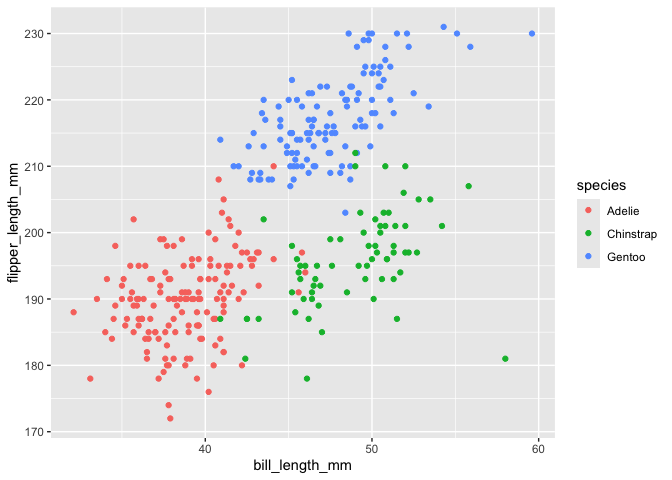

p8105_hw1_yw4817
================
2026-09-26

\#Problem 1

1)  Write a short description of the penguins dataset (not the
    penguins_raw dataset) using inline R code. In your discussion,
    please include: -the data in this dataset, including names / values
    of important variables -the size of the dataset (using nrow and
    ncol) -the mean flipper length

Answer:

``` r
data("penguins", package = "palmerpenguins")
```

The `penguins` contains 8 variables, which are species, island, bill
length, bill depth, flipper lenth, body mass, sex, and year. Important
variables are species, island, and sex. Species include Adelie, Gentoo,
Chinstrap; island includes Torgersen, Biscoe, Dream; sex includes male,
female, NA. The “penguins” dataset contains 344 observations and 8
variables. The mean of flipper length is 200.9152047.

2)  Make a scatterplot of flipper_length_mm (y) vs bill_length_mm (x);
    color points using the species variable (adding color = … inside of
    aes in your ggplot code should help). Export your first scatterplot
    to your project directory using ggsave.

Answer:

``` r
library(tidyverse)
```

``` r
ggplot(
  data = penguins,
  aes(
    x = bill_length_mm,
    y = flipper_length_mm,
    color = species
    )
  ) + geom_point()
```

    ## Warning: Removed 2 rows containing missing values or values outside the scale range
    ## (`geom_point()`).

<!-- -->

``` r
ggsave("penguins_scatterplot.pdf")
```

    ## Saving 7 x 5 in image

    ## Warning: Removed 2 rows containing missing values or values outside the scale range
    ## (`geom_point()`).

\#Problem 2

1)  Create a data frame comprised of: -a random sample of size 10 from a
    standard Normal distribution -a logical vector indicating whether
    elements of the sample are greater than 0 -a character vector of
    length 10 -a factor vector of length 10, with 3 different factor
    “levels”

Answer:

``` r
sample = rnorm(10)
sample_positive = sample > 0
char_vector = c("a", "b", "c", "d", "e", "f", "g", "h", "i", "j")
factor_vector = factor(c("A", "B", "C", "A", "B", "C", "A", "B", "C", "A"))
```

Data Frame:

``` r
p2_df = data.frame(
  sample = sample,
  sample_positive = sample_positive,
  char_vector = char_vector,
  factor_vector = factor_vector)
```

2)  Try to take the mean of each variable in your dataframe. What works
    and what doesn’t?

Answer:

``` r
mean(pull(p2_df, sample))
```

    ## [1] 0.1425128

``` r
mean(pull(p2_df, sample_positive))
```

    ## [1] 0.6

``` r
mean(pull(p2_df, char_vector))
```

    ## Warning in mean.default(pull(p2_df, char_vector)): argument is not numeric or
    ## logical: returning NA

    ## [1] NA

``` r
mean(pull(p2_df, factor_vector))
```

    ## Warning in mean.default(pull(p2_df, factor_vector)): argument is not numeric or
    ## logical: returning NA

    ## [1] NA

The mean works for numerical and logical variables and does not work for
character and factor variables. This is because numerical values are
numbers, and R treats TRUE as 1 and FALSE as 0 for logical variables.
Characters and factors are in text or represent categories, which cannot
be calculated directly.

3)  Write a code chunk that applies the as.numeric function to the
    logical, character, and factor variables (please show this chunk but
    not the output). What happens, and why? Does this help explain what
    happens when you try to take the mean?

Answer:

``` r
as.numeric(pull(p2_df, sample_positive))
as.numeric(pull(p2_df, char_vector))
as.numeric(pull(p2_df, factor_vector))
```

The logical variables are converted to numerical form as 1 and 0 after
applying as.numeric(). Factor variables are also converted to numbers,
while character variables return NA because they cannot be converted to
numbers. This is because factor variables return the numeric codes
corresponding to their factor levels when applying as.numeric(). This
helps explain why the mean works for the logical variable but not for
the character and factor variables.
